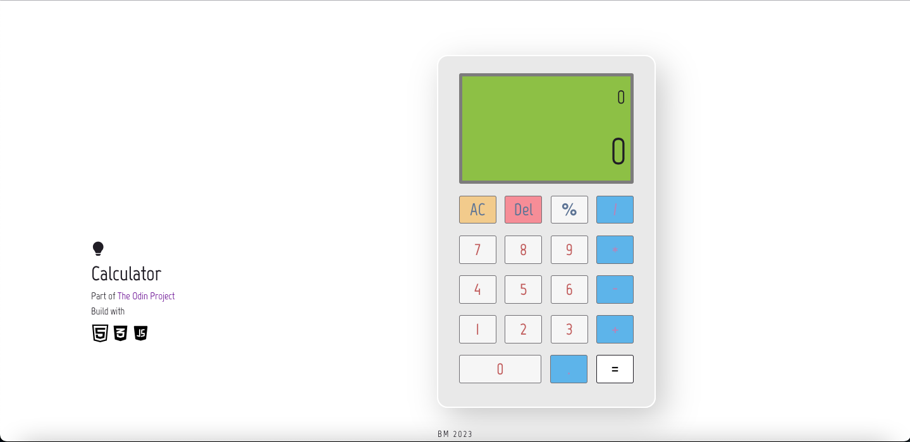

# MathMate

This repository contains a simple web-based calculator implemented using HTML, CSS, and JavaScript. It allows users to perform basic arithmetic calculations such as addition, subtraction, multiplication, and division.

## Features
Users can perform addition, subtraction, multiplication, and division operations.
The calculator displays the entered numbers and the result of the calculation.
Users can clear the calculator's input and start a new calculation.
The calculator handles basic error cases, such as division by zero.
The design is user-friendly and responsive, providing a seamless user experience.

## Getting Started 
To get started with the MathMate, follow these steps:
[Clone or download the repository](https://bbm2910.github.io/MathMate/),
navigate to the project directory, and open the index.html file in a web browser.

Enjoy!

